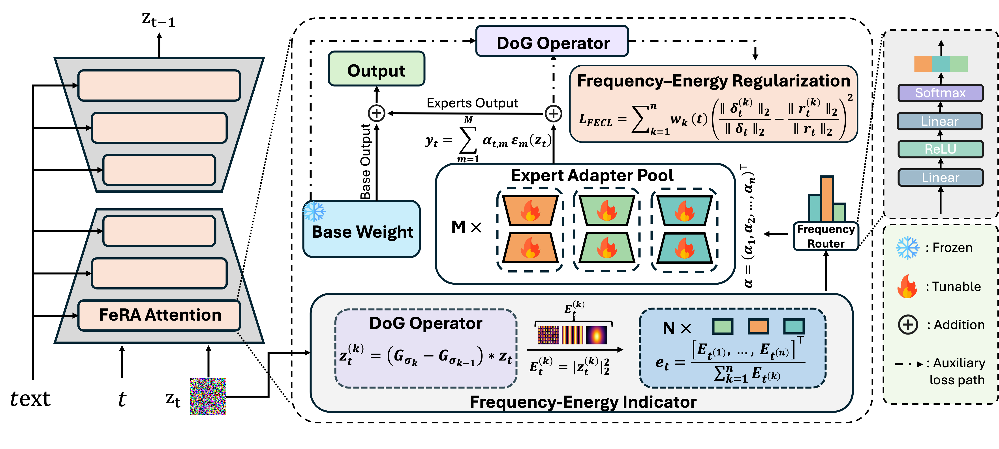

# FeRA: Frequency–Energy Constrained Routing for Effective Diffusion Adaptation Fine-Tuning
[](https://arxiv.org/abs/2511.17979)


> [!IMPORTANT]
> **We are currently working on an integration into the PEFT library**


## 🌟🌟🌟FeRA

<div style="text-align: center;">
  
</div>


## A light Example

```python
import torch
from diffusers import StableDiffusionPipeline
from fera import FeRAConfig, FeRAModel

def train():
    device = "cuda"
    
    pipe = StableDiffusionPipeline.from_pretrained("runwayml/stable-diffusion-v1-5")
    unet = pipe.unet.to(device)
    unet.requires_grad_(False)
    
    config = FeRAConfig(rank=4, num_experts=3, num_bands=3, fecl_weight=0.1)
    fera_model = FeRAModel(unet, config).to(device)
    
    trainable_params = [p for p in fera_model.parameters() if p.requires_grad]
    optimizer = torch.optim.AdamW(trainable_params, lr=1e-4)
    
    batch_size = 2
    latents = torch.randn(batch_size, 4, 64, 64).to(device) # z_t
    timesteps = torch.randint(0, 1000, (batch_size,), device=device).long()
    noise_target = torch.randn_like(latents).to(device) # GT Noise
    text_emb = torch.randn(batch_size, 77, 768).to(device)
    
    optimizer.zero_grad()
    
    fera_model.prepare_forward(latents)
    
    noise_pred_fera = unet(latents, timesteps, text_emb).sample
    
    with torch.no_grad():
        for layer in fera_model.fera_layers: layer.set_routing_weights(None)
        noise_pred_base = unet(latents, timesteps, text_emb).sample

    
    loss_mse = torch.nn.functional.mse_loss(noise_pred_fera, noise_target)
    
    loss_fecl = fera_model.compute_fecl_loss(noise_pred_base, noise_pred_fera, noise_target)
    
    total_loss = loss_mse + loss_fecl
    
    print(f"Loss: {total_loss.item()} (MSE: {loss_mse.item()}, FECL: {loss_fecl.item()})")
    
    total_loss.backward()
    optimizer.step()
    
    fera_model.save_adapters("fera_output.pt")

if __name__ == "__main__":
    train()
```

## Citation
If you are interested in our work, you can cite it!
```
@article{yin2025fera,
  title={FeRA: Frequency-Energy Constrained Routing for Effective Diffusion Adaptation Fine-Tuning},
  author={Yin, Bo and Hu, Xiaobin and Zhou, Xingyu and Jiang, Peng-Tao and Liao, Yue and Zhu, Junwei and Zhang, Jiangning and Tai, Ying and Wang, Chengjie and Yan, Shuicheng},
  journal={arXiv preprint arXiv:2511.17979},
  year={2025}
}
```
